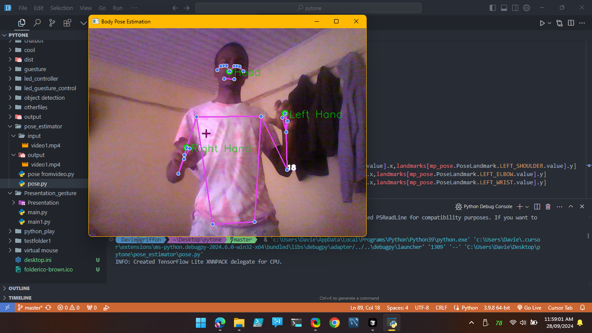

# Pose Estimation with OpenCV  

  

## 📌 Overview  

Welcome to the **Pose Estimation with OpenCV** project! This repository contains code and documentation to perform **human pose estimation** using OpenCV. The project aims to detect and estimate **key body points** in images and video streams using computer vision techniques.  

## 🚀 Features  

- ✅ **Real-time pose estimation** from video streams  
- ✅ **Detection of key points** on the human body  
- ✅ **Visualization of detected poses** with graphical overlays  
- ✅ **Supports multiple video formats** for analysis  

## 🛠️ Software Requirements  

Ensure you have the following installed:  

- Python (3.6 or later)  
- OpenCV (4.0 or later)  
- NumPy (for numerical computations)  
- Optional: Matplotlib (for plotting and visualization)  

## 📥 Installation  

Clone this repository to your local machine:  

```bash
git clone https://github.com/sployal/pose_estimator
cd pose_estimator
```


## 📌 TODO  

- [ ] Improve keypoint detection accuracy  
- [ ] Optimize real-time performance for embedded systems  
- [ ] Add support for more pose estimation models  

## 🤝 Contributing  

Feel free to open an issue or submit a pull request if you find a bug or have an idea for improvement!  

## 📜 License  

This project is licensed under the **MIT License** – see the [LICENSE](LICENSE) file for details.  

## 🙌 Acknowledgements  

Special thanks to the OpenCV community and researchers in the field of computer vision for their valuable contributions! 🚀
